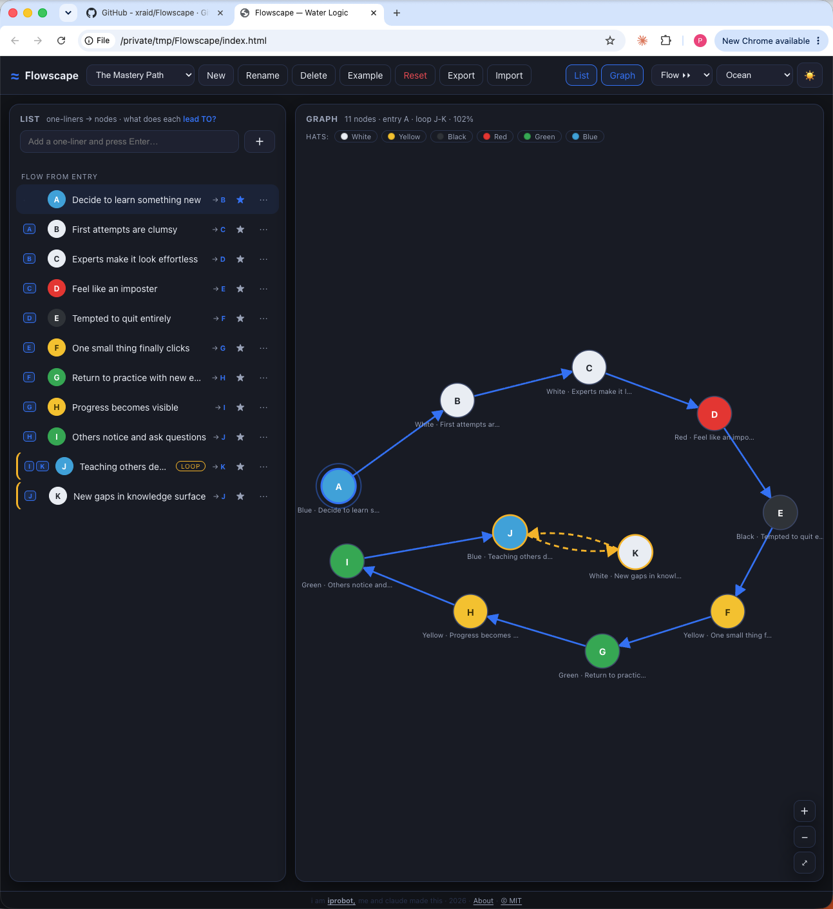

# ≈ Flowscape — Water Logic

> *"From any input, any system with a finite number of states and a tiring factor*
> *will always reach a stable repeating loop."* — Edward de Bono

A thinking tool for pondering things. Not a hierarchy. Not pros and cons.
A **flow** — where each thought leads to ->, until a loop surfaces.



---

## What is a Flowscape?

Think of it as a **shortform mindmap with a disclosed loop**.

You write one-liners about a problem. You connect each one to where it *naturally leads to*.
The structure that emerges — collector points, chains, stable loops — tells you something
the list alone never could.

```
Bored → Open phone → Scroll → Compare → Feel bad → Post → Anxiety → Check phone → Scroll
                                  ↑_______________________________________________↑
                                           the loop surfaces
```

The loop is the thing. It's where the system keeps returning. Change a path, insert a node,
and watch which loop dominates. That's the intervention.

---

## Run it

**Download [`index.html`](./index.html) and open it in your browser. That's it.**

No server. No install. No account. One file.

---

## How it works

| Step | Action |
|------|--------|
| **1. Add nodes** | Type one-liners about your problem, press Enter. Each gets a label A, B, C… |
| **2. Connect** | Right-click a node → *Add path TO…* — where does this naturally lead? |
| **3. Weight** | Right-click an edge → *Make strong path* — mark the most likely direction |
| **4. Set entry** | Click ★ to set the starting point — the list reorders by flow |
| **5. Read** | A **Collector** is where many paths meet. A **Stable loop** is where the system settles |

> **de Bono's rule:** each node has exactly **one strong out** — the one thing it most leads TO.
> Many nodes can flow IN. One flows out. That constraint is what makes the loop surface.


Two views, one model: the **List** and the **Graph** stay in sync — edit in either.

---

## Share a Flowscape

Flowscapes live in your **browser's localStorage** — private, instant, no cloud.

- **Export** → downloads the current Flowscape as a `.json` file
- **Import** → merges from a `.json` file (safe, deduplicates by ID)

Send the file. They open it. Same Flowscape, their browser.

---

## Six Thinking Hats

Tag any node with a de Bono thinking hat to mark what *kind* of thought it is:

| | Hat | Mode |
|-|-----|------|
| ⚪ | White | Facts / information |
| 🟡 | Yellow | Value / optimism |
| ⚫ | Black | Risk / caution |
| 🔴 | Red | Feeling / intuition |
| 🟢 | Green | Creativity / ideas |
| 🔵 | Blue | Process / control |

---

## The idea behind it

**Rock Logic** asks *"Is this true?"*
**Water Logic** asks *"What does this lead TO?"*

Most thinking tools are built on rock logic — categories, criteria, pros/cons.
Water Logic is different. It models **flow**: the way attention, habit, and perception
actually move through a system. The loop that surfaces isn't a failure — it's the answer.
It shows you where the system is stable, and what you'd need to change to shift TO it.

de Bono called it the Flowscape. We built a tool for it.

---

## Built with

Vanilla JS · SVG · localStorage · no dependencies

i am **[iprobot](https://iprobot.com),** me and claude made this · 2026 · [MIT](./LICENSE)
